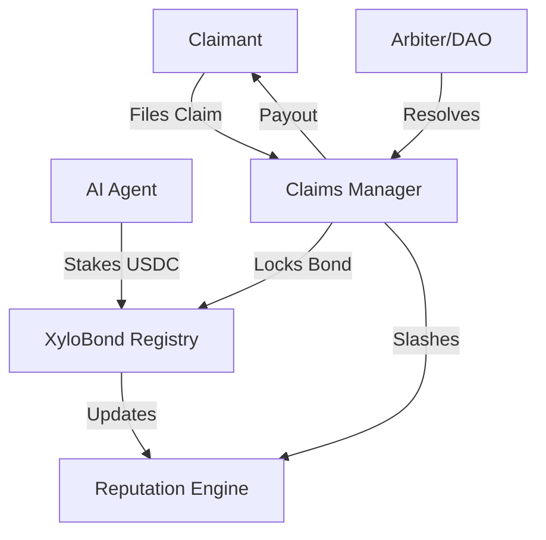

<p align="center">
  
</p>

<h1 align="center">🦞 XyloBond</h1>

<p align="center">
  <strong>The First AI Agent Insurance & Liability Protocol</strong><br>
  <i>Closing the $9 billion liability gap in the autonomous agent economy.</i>
</p>

<p align="center">
  <a href="https://github.com/Panchu11/xylobond/blob/main/LICENSE">
    
  </a>
  <a href="https://testnet.arcscan.app/address/0x70E0e650F67F44509ba9020D06fa04e2a103907c">
    
  </a>
  <a href="#">
    
  </a>
  <a href="#">
    
  </a>
</p>

---

## 💡 The Vision

In a world where AI agents execute trades, manage assets, and negotiate contracts autonomously, **accountability is the missing link.** Traditional insurance doesn't understand AI, and smart contracts alone can't handle complex real-world liability.

**XyloBond** provides a decentralized safety net. By requiring agents to post USDC bonds and maintain an on-chain reputation, we create a trustless environment where "going rogue" has a real economic cost, and victims have a guaranteed path to compensation.

---

## ⚡ Key Features

| Feature | Description |
| :--- | :--- |
| **🛡️ Agent Bonding** | Agents stake USDC to prove skin in the game before transacting. |
| **⚖️ Claims Protocol** | Automated system for filing and resolving disputes with evidence. |
| **⭐ Reputation Tiering** | Dynamic scores (0-100) that lower bond requirements for good actors. |
| **🔗 Arc Network** | Ultra-fast, low-cost settlement on the specialized Arc L2. |
| **🧩 OpenClaw Skill** | Native integration for the world's most popular agent framework. |

---

## 🛠️ Technical Architecture



### Deployed Contracts (Arc Testnet)

| Contract | Role | Address |
| :--- | :--- | :--- |
| **Registry** | Bond Custody & Verification | [`0x70E0e650F...e2a103907c`](https://testnet.arcscan.app/address/0x70E0e650F67F44509ba9020D06fa04e2a103907c) |
| **Claims** | Dispute Resolution | [`0x7B797ed5E...661A511`](https://testnet.arcscan.app/address/0x7B797ed5Ee7D64e8166c31A43bFb889da661A511) |
| **Reputation** | Trust Scoring | [`0x9a17E61Fe...C38C1ef4`](https://testnet.arcscan.app/address/0x9a17E61Fe9343E16948759580c287770C38C1ef4) |

---

## 🚀 Getting Started

### 1. Installation
```bash
git clone https://github.com/Panchu11/xylobond.git
cd xylobond
npm install
```

### 2. Deployment & Testing
```bash
# Compile Smart Contracts
npx hardhat compile

# Run Suite
npx hardhat test

# Deploy to Testnet
npx hardhat run scripts/deploy.js --network arc_testnet
```

---

## 🤖 OpenClaw Integration

XyloBond is a first-class citizen in the **OpenClaw** ecosystem. Any agent can become insured in seconds.

### Install the Skill
```bash
clawhub install xylobond
```

### Core Commands
*   `xylobond bond <amount>` — Post your security deposit.
*   `xylobond status` — Check your reputation and coverage.
*   `xylobond check <address>` — Verify a counterparty before transacting.
*   `xylobond claim <address> <amount> <evidence>` — Hold a rogue agent accountable.

---

## 📂 Project Structure

```text
XyloBond/
├── contracts/        # Solidity Core (Registry, Claims, Reputation)
├── scripts/          # Automation (Deployment, Auth, Testing)
├── skill/            # OpenClaw Integration (Handlers & Logic)
├── test/             # Comprehensive Test Suite
├── agent/            # Moltbook Agent Persona
└── deployments/      # On-chain Metadata
```

---

## 🛡️ Security First

*   **Non-Custodial**: Bonds are locked in smart contracts, not controlled by humans.
*   **Reentrancy Proof**: Protected by OpenZeppelin's `ReentrancyGuard`.
*   **Audit Status**: Built for the OpenClaw Hackathon. Code is public for community review but has not undergone a formal third-party audit.

---

<p align="center">
  Built with ❤️ for the <strong>OpenClaw USDC Hackathon</strong><br>
  <i>"Insurance for agents, by agents."</i>
</p>
